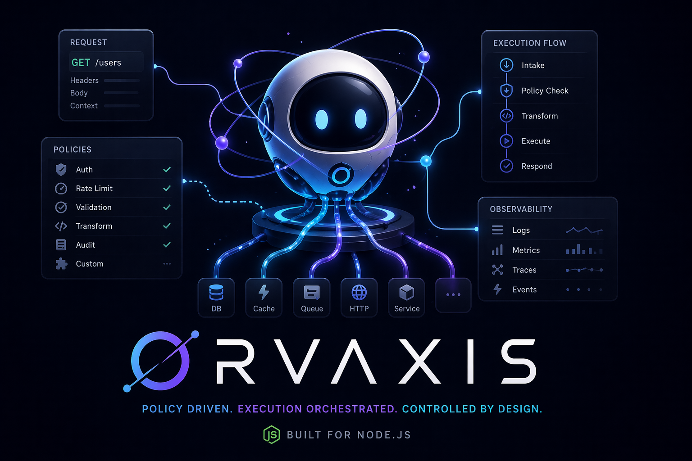

<p align="center">
  
</p>

<h1 align="center">Orvaxis</h1>

<p align="center">
  <a href="https://www.npmjs.com/package/orvaxis"></a>
  <a href="https://github.com/maku85/orvaxis/actions/workflows/ci.yml"></a>
  <a href="LICENSE"></a>
  <a href="https://www.npmjs.com/package/orvaxis"></a>
</p>

<p align="center">
  Lightweight, policy-driven execution runtime for Node.js applications.
</p>

---

## Installation

```bash
npm install orvaxis
```

Install the HTTP adapter peer dependency you intend to use:

```bash
npm install express   # Express adapter
npm install fastify   # Fastify adapter
```

It is not a framework in the traditional sense.
It is an **execution orchestration layer** designed to control, observe, and structure backend request flows in a predictable and composable way.

---

## Why Orvaxis

Minimal frameworks like Express are flexible but unstructured at scale. Opinionated frameworks like NestJS are structured but heavy. Orvaxis is a third option: a **runtime execution layer** that brings explicit ordering, declarative control, and built-in observability without replacing your framework.

[See a concrete side-by-side comparison →](docs/why-orvaxis.md)

---

## Core Principles

### 1. Execution is explicit
Every request passes through a clearly defined lifecycle:
- policies (decision layer)
- hooks (event layer)
- middleware (flow layer)
- route handler (business logic)

---

### 2. Control is declarative
Policies define *what is allowed*, independently from implementation logic.

---

### 3. Structure is hierarchical
Routes are organized in groups with inheritance:
- shared middleware
- shared policies
- scoped execution context

---

### 4. Observability is built-in
Every request produces a trace:
- execution timeline
- performance metrics
- lifecycle events
- debug summary

---

### 5. Extensibility via plugins
System capabilities are extended through plugins that attach to lifecycle hooks.

---

## Architecture Overview
```
Request
↓
Policy Engine (global → group → route)
↓
onRequest hook
↓
beforePipeline hook
↓
Global Pipeline (app.use() middleware)
↓
Group Middleware (inherited)
↓
Route Middleware (scoped)
↓
Route Handler
↓
Trace finalization
↓
afterPipeline hook
↓
Debug output (if enabled)
```

---

## Core Concepts

### Runtime
The central execution engine responsible for orchestrating the full request lifecycle.

### Router
Handles route resolution and grouping:
- method + path matching
- group-based inheritance
- route metadata resolution

### Groups
Logical grouping of routes:
- shared middleware
- shared policies
- prefix-based organization

Example:
```ts
app.group({
  prefix: "/api",
  middleware: [traceMiddleware()],
  policies: [rateLimitPolicy],
  routes: [...]
})
```

---

### Middleware

Functions that participate in execution flow and can:

- mutate context
- control execution flow
- enrich request state

---

### Policies

Pre-execution rules that determine whether a request is allowed.

- can block execution
- can modify context metadata
- can be scoped (route/group/global)
- can be prioritized

Example:
```ts
export const requireApiKey: Policy = {
  name: "require-api-key",
  priority: 100,
  async evaluate(ctx) {
    const key = ctx.req.headers["x-api-key"]
    if (!key) return { allow: false, reason: "Missing X-API-Key header" }
    return { allow: true, modify: { apiKey: key } }
  }
}
```

---

### Hooks

Lifecycle events that allow observation of execution:

- `onRequest` — fired after policy evaluation, before middleware
- `beforePipeline` — fired before the global pipeline runs
- `afterPipeline` — fired after the route handler, trace already finalized
- `onError` — fired on any unhandled error

Hooks do not modify flow; they observe and react.

---

### Plugins

Plugins extend runtime capabilities by registering hooks, middleware, or policies.

Orvaxis ships with a built-in logger plugin:

```ts
import { Orvaxis, loggerPlugin } from "orvaxis"

const app = new Orvaxis()
app.register(loggerPlugin)
```

To write a custom plugin:

```ts
import type { Plugin } from "orvaxis"

const metricsPlugin: Plugin = {
  name: "metrics",
  apply(runtime) {
    runtime.hooks.on("afterPipeline", (ctx) => {
      const duration = ctx.meta.trace?.endTime - ctx.meta.trace?.startTime
      recordMetric("request.duration", duration)
    })
  }
}

app.register(metricsPlugin)
```

Registered plugins are tracked in `runtime.plugins` and applied immediately on registration. `PluginManager` is also exported for custom orchestration.

---

### Tracing System

Each request generates a structured execution trace available as `ctx.meta.trace`:

- `requestId` — unique identifier per request
- `events` — timestamped lifecycle events (`TraceEvent[]`)
- `startTime` / `endTime` — wall-clock boundaries

Use `traceMiddleware()` to automatically record timing around middleware execution:

```ts
import { traceMiddleware } from "orvaxis"

app.group({ prefix: "/api", middleware: [traceMiddleware()], routes: [...] })
```

Emit custom events from anywhere in the call chain with `traceEvent()` — no need to pass `ctx`:

```ts
import { traceEvent } from "orvaxis"

async function fetchUser(id: string) {
  traceEvent("db:query", { table: "users", id })
  // ...
}
```

`traceEvent` is a no-op when called outside a request scope.

---

### Debug Layer

When enabled, the debugger records a structured timeline of every lifecycle step:

```ts
app.debugger.enable()
```

Use `buildExecutionSummary(ctx)` to get a combined view of both the debug timeline and the trace:

```ts
import { buildExecutionSummary } from "orvaxis"

app.on("afterPipeline", (ctx) => {
  const summary = buildExecutionSummary(ctx)
  // summary.requestId  — from ctx.meta.trace
  // summary.duration   — total ms
  // summary.traceEvents — lifecycle events from ctx.meta.trace.events
  // summary.debugSteps  — grouped debug entries (requires debugger enabled)
  // summary.route       — matched route + group
})
```

`buildExecutionSummary` always returns an object — `traceEvents` and `duration` are available even without the debugger enabled.

---

### Execution Model

A request lifecycle is deterministic:

```
1  Policy evaluation     global → group → route, sorted by priority
2  onRequest hook
3  beforePipeline hook
4  Global pipeline       middleware registered via app.use()
5  Group middleware
6  Route middleware
7  Route handler
8  Trace finalization    ctx.meta.trace is set
9  afterPipeline hook
10 Debug output          if app.debugger.enable() was called
```

---

### Typed Context

`OrvaxisContext` accepts two optional type parameters to add compile-time types to `ctx.state` and `ctx.meta`:

```ts
type AppState = { user: { id: string; role: string } }
type AppMeta  = { requestId: string }

type AppContext = OrvaxisContext<AppState, AppMeta>

const handler = async (ctx: AppContext) => {
  ctx.state.user.role   // string
  ctx.meta.requestId    // string
  ctx.meta.tracer       // TracerLike | undefined  (always present from ContextMeta)
}
```

The second parameter is intersected with `ContextMeta`, so all framework-internal fields remain typed.

---

### Request-scoped Context

`getContext()` returns the `OrvaxisContext` for the currently executing request, from anywhere in the async call chain — no need to thread `ctx` through every function:

```ts
import { getContext } from "orvaxis"

async function getCurrentUser() {
  const ctx = getContext()
  return ctx?.state.user
}
```

Returns `undefined` when called outside a request scope. Backed by `AsyncLocalStorage` — concurrent requests are fully isolated.

---

## HTTP Adapters

Orvaxis is not tied to any specific HTTP framework. The core runtime is framework-agnostic — adapters are thin wrappers that normalize the incoming request and delegate to the runtime.

Two adapters are included out of the box:

| Adapter | Import | Peer dependency |
|---|---|---|
| Express | `createExpressServer` | `express ^4` |
| Fastify | `createFastifyServer` | `fastify ^5` |

Install only the framework you intend to use — both peer dependencies are optional.

### Writing a custom adapter

Any adapter needs to:
1. Ensure `req.path` is a plain path string (no query string)
2. Call `app.handle(req, res)` and catch thrown errors
3. Return `{ listen(port, onListen?) }` to satisfy the `ServerAdapter` interface

---

## Testing

`testRequest` runs the full execution cycle — policies, pipeline, middleware, handler — against an `Orvaxis` instance, with no HTTP server required.

```ts
import { Orvaxis, testRequest } from "orvaxis"

const app = new Orvaxis()

app.group({
  prefix: "/api",
  routes: [
    {
      method: "GET",
      path: "/users/:id",
      handler: async (ctx) => {
        ctx.res.json({ id: ctx.meta.route?.params.id })
      },
    },
  ],
})

// successful request
const res = await testRequest(app, { path: "/api/users/42" })
// res.status  → 200
// res.body    → { id: "42" }
// res.ctx     → full OrvaxisContext
// res.error   → undefined

// route not found
const notFound = await testRequest(app, { path: "/api/missing" })
// notFound.status  → 404
// notFound.error   → Error("Not Found")
```

`TestRequestInit` accepts `path`, `method` (defaults to `"GET"`), `headers`, `id`, and any additional field (e.g. `body`) which is forwarded directly onto `req`. `testRequest` never throws — errors thrown during execution are captured in `result.error` and their `.status` property (if present) is reflected in `result.status`.

### Route introspection

`app.routes()` returns the flat list of all registered routes as `RouteInfo[]`, useful for OpenAPI generation and admin tooling:

```ts
import { Orvaxis } from "orvaxis"
import type { RouteInfo } from "orvaxis"

const app = new Orvaxis()

app.group({
  prefix: "/api",
  routes: [
    { method: "GET",  path: "/users",     handler: async () => {} },
    { method: "POST", path: "/users",     handler: async () => {} },
    { method: "GET",  path: "/users/:id", handler: async () => {} },
  ],
})

const routes: RouteInfo[] = app.routes()
// [
//   { method: "GET",  path: "/api/users",     prefix: "/api" },
//   { method: "POST", path: "/api/users",     prefix: "/api" },
//   { method: "GET",  path: "/api/users/:id", prefix: "/api" },
// ]
```

---

## Documentation

- [Why Orvaxis](docs/why-orvaxis.md) — side-by-side comparison with plain Express: auth, rate limiting, and observability with and without Orvaxis
- [Cookbook](docs/cookbook.md) — practical use cases with working examples (authentication, RBAC, rate limiting, tracing, feature flags, and more)
- [Benchmarks](docs/benchmarks.md) — microbenchmark results for each execution layer, plus instructions to run them locally

---

## Example Usage

### Express
```ts
import { Orvaxis, createExpressServer } from "orvaxis"
import type { Policy } from "orvaxis"

const app = new Orvaxis()

const requireApiKey: Policy = {
  name: "require-api-key",
  priority: 100,
  evaluate(ctx) {
    const key = ctx.req.headers["x-api-key"]
    if (!key) return { allow: false, reason: "Missing X-API-Key header" }
    return { allow: true }
  }
}

app.policy(requireApiKey)

app.group({
  prefix: "/api",
  routes: [
    {
      method: "GET",
      path: "/users",
      handler: async (ctx) => {
        ctx.res.json({ users: [] })
      }
    }
  ]
})

const server = createExpressServer(app)
server.listen(3000)
```

### Fastify
```ts
import { Orvaxis, createFastifyServer } from "orvaxis"

const app = new Orvaxis()

app.group({
  prefix: "/api",
  routes: [
    {
      method: "GET",
      path: "/users/:id",
      handler: async (ctx) => {
        ctx.res.send({ id: ctx.meta.route?.params.id })
      }
    }
  ]
})

const server = createFastifyServer(app)
server.listen(3000)
```

---

## Project Structure
```
orvaxis/
  index.ts                   entry point, public API

  core/
    Orvaxis.ts               public-facing class
    Runtime.ts               execution engine
    Router.ts                route matching, groups, and introspection (routes())
    Pipeline.ts              global middleware chain
    PolicyEngine.ts          policy evaluation
    Hook.ts                  hook system
    Tracer.ts                per-request trace
    Debugger.ts              debug timeline
    Context.ts               context factory
    contextStore.ts          AsyncLocalStorage store (getContext)
    testHarness.ts           testRequest helper for unit testing

  debug/
    buildExecutionSummary.ts combined trace + debug summary
    traceEvent.ts            emit custom trace events without ctx

  http/
    expressAdapter.ts        Express adapter
    fastifyAdapter.ts        Fastify adapter

  middleware/
    traceMiddleware.ts       trace timing around middleware execution

  plugins/
    PluginManager.ts         plugin registry (Plugin type + PluginManager class)
    loggerPlugin.ts          built-in logger plugin

  types/
    index.ts                 all shared types

  examples/
    express-server.ts        minimal Express setup
    policy-server.ts         global and route-level policies
    hooks-and-plugins.ts     lifecycle hooks and plugin registration
    debug-trace.ts           debugger, traceEvent, and buildExecutionSummary
    typed-context.ts         typed OrvaxisContext, getContext, traceEvent
    fastify-server.ts        Fastify adapter with policies and param routing
```

---

## Design Philosophy

Orvaxis is built around a few key ideas:

- __Separation of concerns at runtime level__
- __Declarative control of execution__
- __Transparent request lifecycle__
- __Composable system primitives instead of monolithic abstractions__

It favors:

- explicitness over magic
- composition over inheritance
- observability over hidden behavior

---

## Current Status

The core execution model is stable, tested, and covered by 156 passing tests.

Not yet recommended for production. Known gaps before production use:

| Gap | Detail |
|-----|--------|
| **No request timeout** | Handlers that hang are never terminated. Wrap `app.handle()` in a timeout at the adapter level if needed. |
| **API stability** | Pre-1.0 — breaking changes may occur between minor versions. |

Graceful shutdown is supported via `server.close()` on the `ServerAdapter`.

---

## Future Directions

- **OpenTelemetry export** — the trace system already produces structured spans; a plugin exporting to OTLP/Zipkin is a natural next step
- **`beforeHandler` / `afterHandler` hooks** — finer-grained lifecycle events to wrap only the route handler, independent from the global pipeline
- **Response body interception** — a middleware-level API to transform or wrap outgoing response bodies before they are sent
- **Schema validation layer** — a first-class `route.schema` interface (Zod / TypeBox) for declarative body, params, and header validation, consistent with the policy-driven approach

## Contributing

Contributions are welcome. Please read [CONTRIBUTING.md](CONTRIBUTING.md) for setup instructions, code conventions, and the PR process. To report a bug or propose a feature, use the [GitHub issue templates](https://github.com/maku85/orvaxis/issues/new/choose).

---

## License

MIT
