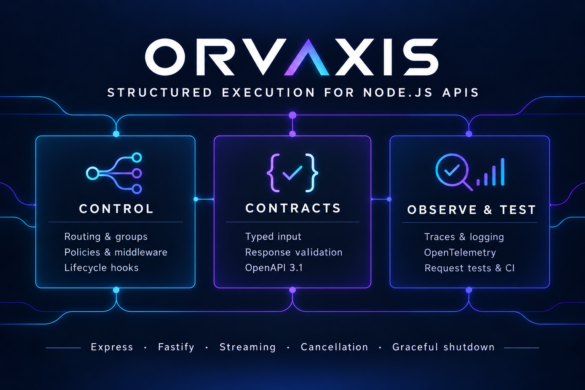

<p align="center">
  
</p>

<h1 align="center">Orvaxis</h1>

<p align="center">
  <a href="https://www.npmjs.com/package/orvaxis"></a>
  <a href="https://github.com/maku85/orvaxis/actions/workflows/ci.yml"></a>
  <a href="LICENSE"></a>
  <a href="https://www.npmjs.com/package/orvaxis"></a>
</p>

<p align="center">
  See which rule stopped an API request, then test the permissions that protect every route.
</p>

---

## Quickstart

Protect a route with named authorization policies. When a request is denied, Orvaxis records the terminal policy and confirms that the handler did not run.

## Installation

```bash
npm install orvaxis express
```

Register authentication globally and ownership on the route that needs it:

```ts
import { Orvaxis, type Policy } from "orvaxis"
import { createExpressServer } from "orvaxis/express"

const authenticate: Policy = {
  name: "authenticate-user",
  evaluate(ctx) {
    const userId = ctx.req.headers["x-user-id"]
    return typeof userId === "string"
      ? { allow: true, modify: { userId } }
      : { allow: false, status: 401, reason: "X-User-ID header required" }
  },
}

const ownerOnly: Policy = {
  name: "report-owner",
  evaluate(ctx) {
    return ctx.meta.userId === ctx.params.ownerId
      ? { allow: true }
      : { allow: false, status: 403, reason: "Only the report owner can view it" }
  },
}

const app = new Orvaxis()
app.policy(authenticate)
app.group({
  prefix: "/api",
  routes: [{
    method: "GET",
    path: "/reports/:ownerId",
    policies: [ownerOnly],
    handler: (ctx) => ctx.res.json({ ownerId: ctx.params.ownerId, report: "quarterly" }),
  }],
})

createExpressServer(app).listen(3000)
```

Run the same [working example](examples/quickstart.ts) from a checkout with `pnpm exec tsx examples/quickstart.ts`, then try the allowed and denied requests:

```bash
curl -i -H 'x-user-id: bob' http://localhost:3000/api/reports/alice  # 403: policy denied
curl -i -H 'x-user-id: alice' http://localhost:3000/api/reports/alice # 200: handler ran
```

The `x-user-id` header is a demo identity input, not authentication. In an application, use the identity established by trusted authentication middleware or token verification.

Orvaxis is an optional execution layer for APIs, not a replacement for Express or Fastify. Install only the adapter peer dependency you use; both are optional. The package ships CommonJS and ESM builds.

---

## Why Orvaxis

Orvaxis makes authorization rules explicit and inspectable without taking routing or handler ownership away from your framework. The benefit is a named, testable explanation when a request is denied.

[See a concrete side-by-side comparison →](docs/why-orvaxis.md)

---

## Architecture Overview
The runtime checks pre-validation policies before middleware, validates declared input before post-validation policies, and calls the handler only after those stages allow the request. The [lifecycle reference](docs/reference/lifecycle.md) documents the exact order, short-circuit behavior, and error hooks.

---

## Core Concepts

Orvaxis groups authorization policies, middleware, hooks, and route handlers into a predictable request flow. Route declarations can inherit policies and middleware from groups; validators and plugins add opt-in behavior.

The [core concepts reference](docs/reference/core-concepts.md) covers the router, policy scopes and priority, hook contracts, plugins, traces, debugging, and typed context. The [lifecycle reference](docs/reference/lifecycle.md) shows the actual execution order.

---

## HTTP Adapters

Orvaxis is not tied to any specific HTTP framework. The core runtime is framework-agnostic — adapters are thin wrappers that normalize the incoming request and delegate to the runtime.

Two adapters are included out of the box:

| Adapter | Import | Peer dependency |
|---|---|---|
| Express | `createExpressServer` from `orvaxis/express` | `express ^4.20 \|\| ^5` |
| Fastify | `createFastifyServer` from `orvaxis/fastify` | `fastify ^5` |

Install only the framework you intend to use — both peer dependencies are optional. Each adapter lives on its own subpath (`orvaxis/express`, `orvaxis/fastify`) precisely so that importing the main `orvaxis` entry point never requires either peer dependency to be installed.

Both adapters mount Orvaxis as a single catch-all handler (`server.use(...)` on Express, `fastify.all("/*", ...)` on Fastify) and delegate all routing, hooks, and validation to the Orvaxis runtime. On Express this costs nothing, since Express has no comparable router/validation layer of its own. On Fastify it means you don't benefit from Fastify's own route trie or its compiled (ajv-based) schema validation — those are bypassed, not used. Pick the Fastify adapter for the transport (HTTP/1.1, HTTP/2, its plugin ecosystem for things unrelated to routing) or for consistency with an existing Fastify deployment, not for a routing or validation performance win over Express.

#### Add Orvaxis policies to one existing Express route

For a route whose handler should stay in Express, follow the [existing route integration guide](docs/guide/integrate-existing-route.md). It covers middleware placement, identity mapping, the mirrored route declaration, and validation boundaries.

### Query string parsing differs between adapters

`ctx.req.query` is typed as `Record<string, string | string[]>` on both adapters, but Express's default query parser (`qs`, in "extended" mode) does not actually guarantee that shape: bracket notation is parsed into **nested objects**.

```
GET /search?filter[status]=active
```

| Adapter | `ctx.req.query.filter` |
|---|---|
| Express (default) | `{ status: "active" }` — an object, not a string |
| Fastify (default) | `"active"` under the literal key `"filter[status]"` — brackets are not special |

Code that reads a query value directly and assumes it's a string (`ctx.req.query.filter.toUpperCase()`) compiles under the declared type but can throw at runtime on Express if a client sends bracketed keys. Two ways to avoid this:

- Validate query params with `route.schema.query` (see [Plugins → `schemaValidationPlugin`](docs/reference/core-concepts.md#plugins)) — this reshapes and checks `ctx.req.query` at the boundary regardless of adapter.
- Or, if you don't use query schemas and want the declared type to actually hold, switch Express to the non-nesting parser: `expressApp.set("query parser", "simple")` before passing it to `createExpressServer`. This affects the whole Express app instance, including any routes you mount outside Orvaxis, so prefer it only when you control the entire app.

### Timeout

Both adapters accept an optional `AdapterOptions` third argument:

```ts
import { createExpressServer } from "orvaxis/express"

// default: 30 000 ms
const server = createExpressServer(app)

// custom deadline
const server = createExpressServer(app, undefined, { timeout: 10_000 })

// disabled (long-running handlers, streaming, etc.)
const server = createExpressServer(app, undefined, { timeout: 0 })
```

When the deadline expires the adapter sends a 408 response and sets `ctx.req.signal` to aborted, so any downstream work that accepts an `AbortSignal` is cancelled immediately:

```ts
handler: async (ctx) => {
  // fetch is aborted if the request times out
  const res = await fetch("https://api.example.com/data", { signal: ctx.req.signal })
  ctx.res.json(await res.json())
}
```

`ctx.req.signal` is always defined when using the built-in adapters. Pass it to `node:http` requests, database drivers (pg, mongodb, prisma), or any API that accepts an `AbortSignal` to stop work the client will never see. The same option is available on `createFastifyServer`.

`withTimeout` and `AdapterOptions` are exported from the main entry point so custom adapters can reuse them:

```ts
import { withTimeout, type AdapterOptions } from "orvaxis"
```

### Graceful shutdown

When `close()` is called (e.g. on `SIGTERM`), the adapter stops accepting new connections and waits for active requests to finish. A `shutdownTimeout` cap (default `10 000 ms`) forces `closeAllConnections()` if active connections do not drain in time, so the process always exits cleanly under Kubernetes, systemd, and other orchestrators.

**In-flight requests are notified via the same `ctx.req.signal` used for timeouts.** Before waiting for connections to drain, `close()` aborts the `AbortSignal` of every request still in flight. A long-lived handler — an SSE loop, a chunked NDJSON stream — can listen for this exactly like it already does for timeouts, and end itself cleanly (send a final message, call `ctx.res.end()`) instead of being cut off by `shutdownTimeout`:

```ts
handler: async (ctx) => {
  ctx.res.write(": ping\n\n")
  await new Promise<void>((resolve) => {
    ctx.req.signal?.addEventListener("abort", resolve, { once: true })
  })
  // fires both on a request timeout and on server shutdown — same signal, same handling
  ctx.res.write("event: bye\ndata: server shutting down\n\n")
  ctx.res.end()
}
```

If a handler doesn't listen for the signal, nothing changes: `shutdownTimeout` still forces the connection closed as before. This is a notification, not a kill switch.

```ts
// default: 10 000 ms forced-close deadline
const server = createExpressServer(app)

// custom deadline
const server = createExpressServer(app, undefined, { shutdownTimeout: 5_000 })

// disable forced close (wait indefinitely — not recommended in production)
const server = createExpressServer(app, undefined, { shutdownTimeout: 0 })
```

Typical SIGTERM handler:

```ts
const server = createExpressServer(app, undefined, { shutdownTimeout: 10_000 })
await server.listen(3000)

process.once("SIGTERM", () => server.close())
process.once("SIGINT",  () => server.close())
```

### Body size limits

Orvaxis does not enforce its own body size limit. The ceiling is set entirely by the body-parsing layer of the underlying framework, **before** the request reaches the Orvaxis runtime.

**Express** — body parsing is opt-in. Pass a `limit` to `express.json()` (default `"100kb"`):

```ts
import express from "express"
import { createExpressServer } from "orvaxis/express"

const server = express()
server.use(express.json({ limit: "256kb" }))
server.use(express.urlencoded({ limit: "256kb", extended: true }))

const adapter = createExpressServer(app, server)
```

**Fastify** — the `bodyLimit` constructor option applies globally (default: `1048576` = 1 MB):

```ts
import Fastify from "fastify"
import { createFastifyServer } from "orvaxis/fastify"

const fastify = Fastify({ bodyLimit: 256 * 1024 })   // 256 KB

const adapter = createFastifyServer(app, fastify)
```

**Custom adapters and `testRequest`** — neither enforces a body size limit. For custom adapters, implement the check at the stream level before forwarding the parsed body to `app.handle`. The `testRequest` helper is for unit tests where body size is controlled by the test author.

---

### Error responses

Every error response from the built-in adapters follows a standard `ErrorResponse` envelope:

```ts
import type { ErrorResponse } from "orvaxis"
// { error: string; code?: string; requestId?: string; details?: unknown }
```

Fields populated on every response:

| Field | Source | Always present |
|---|---|---|
| `error` | `sanitizeErrorMessage(err)` | yes |
| `code` | `err.code` when set on `HttpError` | no |
| `requestId` | request's `X-Request-ID` value | yes |
| `details` | `err.details` when set on `HttpError` | no |

Message sanitization depends on `NODE_ENV`:

| Environment | Generic `Error` | `HttpError` |
|---|---|---|
| `production` | `"Internal Server Error"` | original message |
| anything else | original message | original message |

`HttpError` messages are always forwarded because they are intentional user-facing responses. All other error messages are hidden in production to avoid leaking internal details such as stack traces, file paths, or database error text.

**This includes errors that never reach the Orvaxis runtime.** A malformed JSON body rejected by `express.json()`, or a request over Fastify's `bodyLimit`, happens in the underlying framework's own parsing layer, before Orvaxis's routing and policies ever run. Both adapters register a dedicated error handler for this case (a 4-arg middleware on Express, `fastify.setErrorHandler` on Fastify) so these responses go through the same `ErrorResponse` envelope and carry the same `requestId` — instead of Express's default HTML error page or Fastify's native `{ statusCode, code, error, message }` shape.

The built-in router applies this rule to its own 404: outside production the message includes the unmatched path (`"Not Found: /api/users/42"`) to make debugging faster; in production it falls back to the generic `"Not Found"` to avoid reflecting user-controlled input in the response body.

`buildErrorBody` and `sanitizeErrorMessage` are exported for custom adapters:

```ts
import { buildErrorBody } from "orvaxis"

// in a custom adapter's catch block — produces the full ErrorResponse envelope:
res.status(err.status ?? 500).json(buildErrorBody(err, requestId))
```

### Request ID

Both adapters automatically assign a request ID on every request and return it in the `X-Request-ID` response header. The ID is also available as `ctx.req.id` throughout the entire execution lifecycle.

Priority order for the ID value:

1. `X-Request-ID` header from the incoming request — honours upstream propagation (API gateway, service mesh, distributed tracing)
2. Fastify's native request ID (Fastify adapter only)
3. `crypto.randomUUID()` — generated if none of the above is present

```ts
app.on("afterPipeline", (ctx) => {
  console.log(ctx.req.id) // always defined — e.g. "550e8400-e29b-41d4-a716-446655440000"
})
```

The header name is configurable via `requestIdHeader` on `AdapterOptions`, for stacks that use a different convention (`X-Correlation-ID`, `X-Trace-ID`, …). It applies to both reading the incoming header and setting the outgoing one — the default remains `X-Request-ID`:

```ts
const server = createExpressServer(app, undefined, { requestIdHeader: "X-Correlation-ID" })
// same option name on createFastifyServer
```

`loggerPlugin` automatically includes the ID in every structured log:

```
{ type: "request", method: "GET", path: "/api/users", requestId: "550e8400-e29b-41d4-a716-446655440000" }
{ type: "response", method: "GET", path: "/api/users", status: 200, durationMs: 8, requestId: "550e8400-e29b-41d4-a716-446655440000" }
```

### Streaming

`ctx.res` exposes three methods for streaming responses:

| Method | Behaviour |
|--------|-----------|
| `ctx.res.write(chunk)` | Sends a chunk to the client without closing the connection |
| `ctx.res.end(chunk?)` | Sends an optional final chunk and closes the connection |
| `ctx.res.pipe(stream)` | Pipes a `node:stream.Readable` directly to the response |

```ts
app.group({
  prefix: "/api",
  routes: [
    {
      method: "GET",
      path: "/events",
      handler: async (ctx) => {
        ctx.res.setHeader("Content-Type", "text/event-stream")
        ctx.res.setHeader("Cache-Control", "no-cache")

        ctx.res.write("data: connected\n\n")

        // send a few events then close
        for (let i = 1; i <= 3; i++) {
          ctx.res.write(`data: event ${i}\n\n`)
        }

        ctx.res.end()
      },
    },
    {
      method: "GET",
      path: "/file/:name",
      handler: async (ctx) => {
        const { createReadStream } = await import("node:fs")
        const stream = createReadStream(`/data/${ctx.meta.route!.params.name}`)
        ctx.res.pipe(stream)
      },
    },
  ],
})
```

When using the built-in adapters, disable the default 30 s timeout for long-lived streaming connections:

```ts
const server = createExpressServer(app, undefined, { timeout: 0 })
```

For testing, `testRequest` captures all chunks in `result.chunks` and exposes `result.ended`, so streaming handlers do not require a live server.

### Writing a custom adapter

Any adapter needs to:
1. Ensure `req.path` is a plain path string (no query string)
2. Create an `AbortController`, attach its `signal` to the request, and pass the controller as the third argument to `withTimeout` so that in-flight work is cancelled when the deadline expires
3. Enforce a body size limit at the stream level before forwarding the parsed body to `app.handle` — Orvaxis does not apply any limit of its own
4. Call `app.handle(req, res)` (wrapped in `withTimeout` if a deadline is needed) and catch thrown errors, using `buildErrorBody(err, requestId)` to build the response body
5. Return `{ listen(port, onListen?), close() }` to satisfy the `ServerAdapter` interface
6. In `close()`, call `server.closeIdleConnections()` before `server.close()` to release idle keep-alive connections immediately, then set a `setTimeout(() => server.closeAllConnections(), shutdownTimeout)` deadline (default 10 s) that force-closes remaining connections if they do not drain in time; clear the timer in the close callback so it never fires when shutdown completes cleanly

---

## Testing

`testRequest` runs the full execution cycle — policies, pipeline, middleware, handler — against an `Orvaxis` instance, with no HTTP server required.

```ts
import { Orvaxis } from "orvaxis"
import { testRequest } from "orvaxis/testing"

const app = new Orvaxis()

app.group({
  prefix: "/api",
  routes: [
    {
      method: "GET",
      path: "/users/:id",
      handler: async (ctx) => {
        ctx.res.json({ id: ctx.meta.route?.params.id })
      },
    },
  ],
})

// successful request
const res = await testRequest(app, { path: "/api/users/42" })
// res.status  → 200
// res.body    → { id: "42" }
// res.ctx     → full OrvaxisContext
// res.error   → undefined

// with query params
const search = await testRequest(app, { path: "/api/users/42", query: { expand: "profile" } })
// search.ctx.req.query → { expand: "profile" }

// route not found
const notFound = await testRequest(app, { path: "/api/missing" })
// notFound.status  → 404
// notFound.error   → Error("Not Found: /api/missing")  (path included outside production)

// streaming handler
const streamed = await testRequest(app, { path: "/api/stream" })
// streamed.chunks  → ["chunk1", "chunk2"]   (written via ctx.res.write)
// streamed.ended   → true                   (ctx.res.end was called)
```

`TestRequestInit` accepts `path`, `method` (defaults to `"GET"`), `headers`, `query`, `id`, and any additional field (e.g. `body`) which is forwarded directly onto `req`. `query` is typed as `Record<string, string | string[]>` and maps directly to `ctx.req.query` inside the handler: `testRequest` never throws — errors thrown during execution are captured in `result.error`, the request context remains available in `result.ctx`, and the error's `.status` property (if present) is reflected in `result.status`. Failed traces are finalized before `onError`, and `trace.events` contains bounded policy decisions according to the configured `policyTrace` mode. The error remains the original thrown error; `testRequest` does not build the HTTP `ErrorResponse` envelope produced by adapters. For streaming handlers, `result.chunks` holds all values passed to `ctx.res.write` and `ctx.res.end`, and `result.ended` is `true` when `ctx.res.end` was called.

All testing utilities are available from the `orvaxis/testing` sub-path and are excluded from the production bundle:

```ts
import { testRequest, createMockResponse, type TestRequestInit, type TestResponse, type MockResponse } from "orvaxis/testing"
```

#### Permission matrices

Use `testPolicyMatrix` to run role, identity, tenant, and ownership cases against real policy execution. Each scenario executes once through `testRequest`; the helper compares the HTTP status, terminal policy name, and whether the handler ran using the finalized request trace. It returns mismatches instead of throwing, so the complete report remains available on failure:

```ts
import { expect, it } from "vitest"
import { formatPolicyMatrixReport, testPolicyMatrix } from "orvaxis/testing"

it("enforces document permissions", async () => {
  const report = await testPolicyMatrix(app, [
    {
      name: "anonymous request",
      request: { path: "/api/documents/42" },
      expected: { status: 401, policy: "authenticate", handlerExecuted: false },
    },
    {
      name: "document owner",
      request: { path: "/api/documents/42", headers: { "x-user": "alice" } },
      expected: { status: 200, policy: null, handlerExecuted: true },
    },
  ])

  expect(report.passed, formatPolicyMatrixReport(report)).toBe(true)
})
```

For a complete anonymous/owner/other-user/other-tenant/admin example, run `pnpm exec tsx examples/policy-matrix.ts`. The report contains scenario names, status, policy, and handler reachability; it omits request headers and values. `ctx.meta.trace.handlerExecuted` records whether the runtime invoked the route handler, including when that handler throws.

#### Static policy requirements for CI

`checkPolicyRequirements` checks an inspected route inventory without executing policy predicates, evaluators, or handlers. Selectors use exact route templates or path globs: `*` matches one segment, and `**` matches zero or more trailing segments. Method filters and exceptions keep public endpoints explicit; every exception requires a reason. A selector matching no routes fails so a typo cannot pass vacuously.

```ts
import { expect, it } from "vitest"
import { checkPolicyRequirements, formatPolicyRequirementReport } from "orvaxis/testing"

it("keeps authentication on private endpoints", () => {
  const report = checkPolicyRequirements(app.inspectRoutes(), [
    {
      name: "private API authentication",
      paths: ["/api/private/**"],
      methods: ["GET", "POST"],
      requirePolicies: ["authenticate"],
      exceptions: [
        { path: "/api/private/health", methods: ["GET"], reason: "Public health probe" },
      ],
    },
  ])

  expect(report.passed, formatPolicyRequirementReport(report)).toBe(true)
})
```

Each selected route is reported as `PASS`, `FAIL`, `UNVERIFIABLE`, or `EXCLUDED`. A required policy whose scope is conditional—such as a regex or predicate—is `UNVERIFIABLE` by default and does not fail the report; pass `{ failOnUnverifiable: true }` to make that strict in CI. Missing policies and selectors that match no routes always fail. The static check only verifies declared policy configuration; it cannot prove what an arbitrary `evaluate()` function does. Keep runtime permission cases in a separate `testPolicyMatrix` assertion. Run `pnpm exec tsx examples/policy-ci-check.ts` for both checks together.

### Route introspection

`app.routes()` returns the flat list of all registered routes as `RouteInfo[]`, useful for OpenAPI generation and admin tooling:

```ts
import { Orvaxis } from "orvaxis"
import type { RouteInfo } from "orvaxis"

const app = new Orvaxis()

app.group({
  prefix: "/api",
  routes: [
    { method: "GET",  path: "/users",     handler: async () => {} },
    { method: "POST", path: "/users",     handler: async () => {} },
    { method: "GET",  path: "/users/:id", handler: async () => {} },
  ],
})

const routes: RouteInfo[] = app.routes()
// [
//   { method: "GET",  path: "/api/users",     prefix: "/api" },
//   { method: "POST", path: "/api/users",     prefix: "/api" },
//   { method: "GET",  path: "/api/users/:id", prefix: "/api" },
// ]
```

For policy configuration, `app.inspectRoutes()` returns one static description per route with its inherited global, group, and route policies:

```ts
const inspected = app.inspectRoutes()
const users = inspected.find((route) => route.path === "/api/users/:id")

users?.policies.map(({ id, name, layer, phase, priority, order, applicability }) => ({
  id,
  name,
  layer,
  phase,
  priority,
  order,
  applicability,
}))
```

Policies are listed in runtime order: pre-validation global → group → route, then post-validation global → group → route. `id` distinguishes declarations even when names repeat; `nameAmbiguous` flags duplicate names across the endpoint's effective policy set. `applicability.status` is `always`, `never`, or `conditional`: string scopes are compared conservatively with the route template and method, while regexes, predicates, paths crossing route parameters or wildcards, and implicit GET-to-HEAD fallback stay conditional. The inspector never calls policy evaluators, handlers, or scope predicates. This is configuration metadata, not a prediction of the policy result or a security guarantee based on policy names. The existing `app.routes()` API and its `RouteInfo[]` result are unchanged.

---

## Documentation

- [Quickstart](#quickstart) — protect one route and see the allowed/denied result
- [Add Orvaxis to an existing Express route](docs/guide/integrate-existing-route.md) — add policy checks without moving the handler
- [Multi-tenant task demo](docs/guide/multi-tenant-demo.md) — runnable tenant, ownership, roles, traces, permission matrix, and CI checks
- [Diagnose a 403](docs/guide/diagnose-403.md) — find the terminal policy and verify skipped stages
- [Request lifecycle reference](docs/reference/lifecycle.md) — hook, middleware, validation, and policy order
- [Core concepts reference](docs/reference/core-concepts.md) — router, policies, hooks, plugins, tracing, and context
- [Diagnosing an API 403](docs/articles/diagnosing-a-403.md) — trace a denial to its terminal policy
- [Tenant authorization](docs/articles/tenant-authorization.md) — separate tenant access, ownership, and roles
- [Authorization requirements in CI](docs/articles/authorization-requirements-in-ci.md) — combine static route checks with permission tests
- [Why Orvaxis](docs/why-orvaxis.md) — side-by-side comparison with plain Express: auth, rate limiting, and observability with and without Orvaxis
- [Cookbook](docs/cookbook.md) — practical use cases with working examples (authentication, RBAC, rate limiting, tracing, feature flags, and more)
- [Benchmarks](docs/benchmarks.md) — microbenchmark results for each execution layer, plus instructions to run them locally
- [Roadmap (Italian)](docs/roadmap.md) — proposed runtime fixes, policy diagnostics, incremental adoption, and acceptance criteria

---

## Example Usage

The [multi-tenant task demo](docs/guide/multi-tenant-demo.md) includes runnable server commands, fixture identities, expected responses, permission traces, and the CI check. Its fixture storage is in-memory and local to the process.

### Express
```ts
import { Orvaxis } from "orvaxis"
import { createExpressServer } from "orvaxis/express"
import type { Policy } from "orvaxis"

const app = new Orvaxis()

const requireApiKey: Policy = {
  name: "require-api-key",
  priority: 100,
  evaluate(ctx) {
    const key = ctx.req.headers["x-api-key"]
    if (!key) return { allow: false, reason: "Missing X-API-Key header" }
    return { allow: true }
  }
}

app.policy(requireApiKey)

app.group({
  prefix: "/api",
  routes: [
    {
      method: "GET",
      path: "/users",
      handler: async (ctx) => {
        ctx.res.json({ users: [] })
      }
    }
  ]
})

const server = createExpressServer(app)
server.listen(3000)
```

### Fastify
```ts
import { Orvaxis } from "orvaxis"
import { createFastifyServer } from "orvaxis/fastify"

const app = new Orvaxis()

app.group({
  prefix: "/api",
  routes: [
    {
      method: "GET",
      path: "/users/:id",
      handler: async (ctx) => {
        ctx.res.send({ id: ctx.meta.route?.params.id })
      }
    }
  ]
})

const server = createFastifyServer(app)
server.listen(3000)
```

---

## Project Structure
```
orvaxis/
  index.ts                   entry point, public API (no optional peer dependencies)
  express.ts                 orvaxis/express entry point (server adapter and policy guard)
  fastify.ts                 orvaxis/fastify entry point (createFastifyServer)
  otel.ts                    orvaxis/otel entry point (otelPlugin)
  testing.ts                 orvaxis/testing entry point

  core/
    Orvaxis.ts               public-facing class
    Runtime.ts               execution engine
    Router.ts                route matching, groups, and introspection (routes())
    Pipeline.ts              global middleware chain
    PolicyEngine.ts          policy evaluation
    Hook.ts                  hook system
    Tracer.ts                per-request trace
    Debugger.ts              debug timeline
    Context.ts               context factory
    contextStore.ts          AsyncLocalStorage store (getContext)
    HttpError.ts             HttpError class (status + message + cause)
    testHarness.ts           testRequest and policy-matrix helpers for unit testing
    policyRequirements.ts    static route-policy checks for CI (exported via orvaxis/testing)
    mockResponse.ts          createMockResponse (exported via orvaxis/testing)
    utils.ts                 shared utilities (mergeSafe, UNSAFE_KEYS)

  debug/
    buildExecutionSummary.ts combined trace + debug summary
    traceEvent.ts            emit custom trace events without ctx

  http/
    expressAdapter.ts        Express adapter (exported via orvaxis/express)
    fastifyAdapter.ts        Fastify adapter (exported via orvaxis/fastify)
    timeout.ts               withTimeout helper and AdapterOptions type

  middleware/
    traceMiddleware.ts       trace timing around middleware execution

  plugins/
    PluginManager.ts         plugin registry (Plugin type + PluginManager class)
    loggerPlugin.ts          built-in logger plugin
    otelPlugin.ts            OpenTelemetry SERVER span per request + orvaxis.pipeline/orvaxis.handler child spans (exported via orvaxis/otel, requires @opentelemetry/api)
    schemaValidationPlugin.ts body/params/query/headers validation via route.schema
    responseValidationPlugin.ts status-specific handler response validation; streaming is not buffered

  openapi/
    generateOpenApiDocument.ts  optional-converter OpenAPI 3.1 generation from inspected routes (orvaxis/openapi)

  types/
    index.ts                 all shared types

  examples/
    express-server.ts        minimal Express setup
    policy-server.ts         global and route-level policies
    policy-matrix.ts         identity, ownership, tenant, and admin test scenarios
    policy-ci-check.ts       static policy requirements plus dynamic permission checks
    tenant-tasks.ts          shared multi-tenant task fixtures, policies, and permission matrix
    tenant-tasks-server.ts   runnable Express API for the multi-tenant task example
    tenant-tasks-check.ts    CI policy requirements, matrix assertions, and decision traces
    quickstart.ts            protected-route Express quickstart
    typed-schema.ts          inferred body, params, query, and header outputs
    hooks-and-plugins.ts     lifecycle hooks and plugin registration
    debug-trace.ts           debugger, traceEvent, and buildExecutionSummary
    typed-context.ts         typed OrvaxisContext, getContext, traceEvent
    otel-plugin.ts           otelPlugin with child spans + custom span enrichment
    fastify-server.ts        Fastify adapter with policies and param routing
    wildcard-routing.ts      named wildcard (/*filepath), unnamed catch-all (/*), priority demo
    streaming.ts             SSE, NDJSON, and file streaming via write/end/pipe
```

---

## Design Philosophy

Orvaxis is built around a few key ideas:

- __Separation of concerns at runtime level__
- __Declarative control of execution__
- __Transparent request lifecycle__
- __Composable system primitives instead of monolithic abstractions__

It favors:

- explicitness over magic
- composition over inheritance
- observability over hidden behavior

---

## Current Status

The core execution model is stable, tested, and covered by 347 passing tests.

Not yet recommended for production. Known gaps before production use:

| Gap | Detail |
|-----|--------|
| **API stability** | Pre-1.0 — breaking changes may occur between minor versions. |

Graceful shutdown is supported via `server.close()` on the `ServerAdapter`. Both built-in adapters enforce a `shutdownTimeout` (default 10 s) so the process exits cleanly even when active connections stall.

---

## Future Directions

- **OpenTelemetry export** — the trace system already produces structured spans; a plugin exporting to OTLP/Zipkin is a natural next step

## Contributing

Contributions are welcome. Please read [CONTRIBUTING.md](CONTRIBUTING.md) for setup instructions, code conventions, and the PR process. To report a bug or propose a feature, use the [GitHub issue templates](https://github.com/maku85/orvaxis/issues/new/choose).

---

## License

MIT
